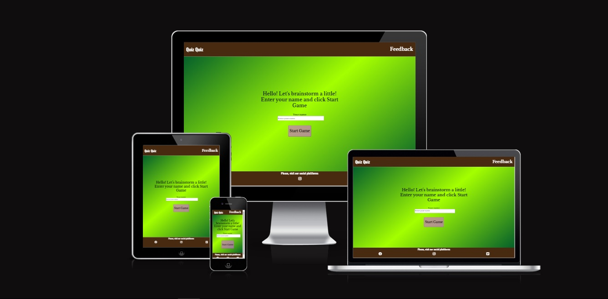
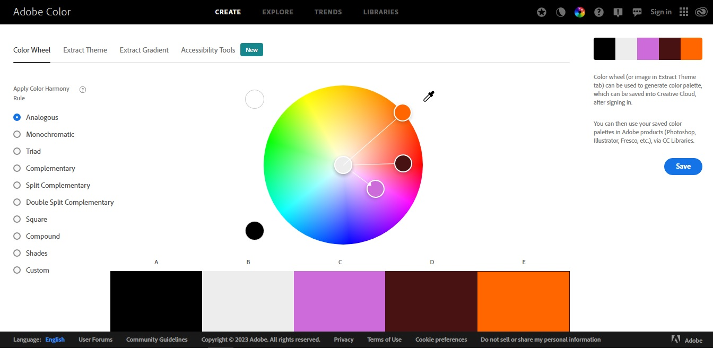

# Quiz Quiz
(Developer: Bilan Mykhailo)

The site presents a quiz in which the user can test their knowledge in several disciplines: nature, history, geography and logic. The user's action is to select the correct answer to the question asked. At the end of the quiz, the result that the user has achieved is displayed. Also, the user can leave feedback on a separate page of the site by filling out the feedback form.

[Live webpage](https://belan-mihail.github.io/quiz-quiz/)

## Table of Content

1. [Project Goals](#project-goals)
    1. [User Goals](#user-goals)
    2. [Site Owner Goals](#site-owner-goals)
2. [User Experience](#user-experience)
    1. [Target Audience](#target-audience)
    2. [User Requrements and Expectations](#user-requrements-and-expectations)
    3. [User Stories](#user-stories)
    4. [Site Owner Stories](#site-owner-stories)
3. [Design](#design)
    1. [Design Choices](#design-choices)
    2. [Colors](#colors)
    3. [Fonts](#fonts)

 

## Project Goals

### User Goals

 - Pass an interesting quiz.
- Test your knowledge in various disciplines.
- Re-pass the quiz to increase your score.
- Leave feedback.

### Site Owner Goals

  - Increase in the number of guests;
  - Getting positive feedback from site users;

## User Experience

### Target Audience

- A student who wants to test his knowledge in various disciplines or wants to take a quiz.
- An adult who wants to test their knowledge in various disciplines or wants to take a quiz.

### User Requrements and Expectations

- Simple and user-friendly website design;
- Interactive interaction with the user (reaction to user actions)
- Availability of the site on various devices

### User Stories 

1. As a user, I want to display my name for later use by the site.
2. As a user, I want to test my knowledge in various disciplines.
3. As a user, I want to have a choice of answers to a given question.
4. As a user, I want to be notified if my answer is correct
5. As a user, I want to get the output of my result after passing the quiz
6. As a user, I want to be able to repeat the quiz to improve my score
7. As a user, I want to repeat the quiz to provide a new conclusion about my result
8. As a user, I want to be able to leave feedback about the quiz.
9. As a user, I want to be able to visit the social platforms of the project

### Site Owner Stories

1. As a owner of the site, i want increase in the number of guests;
2.  As a owner of the site, i want getting positive feedback from site users; 

## Design

### Design Choices

The site is designed to maximize the interest of users by the simplicity and use of its use. The design of the site is designed in such a way that the user can quickly and easily figure out how to use the site and easily get the desired result (the ability to play a quiz).

### Colors

For the text content of the header and footer of the site, a white color was chosen, which contrasts well with the dark background. For the text content of the main block, black was chosen to contrast well with the green background. Orange was chosen for the hover effects. I used Adobe Color to select the color.

Screenshot (Adobe Color)

### Fonts

For header and footer text, the Oswald font is used, connected using google fonts. For main, Libre Baskerville font was used with more bold fonts. Used fonts are well combined with each other

### Structure

The page is structured in a well know and user friendly. Upon arriving to the website the user sees a familiar type of navigation bar with the logo on the left side and the navigation links to the right. The website consists of two separate pages:

- **Home Page:** This is the main page of the site, which displays all the stages of the quiz. The page is conditionally divided into header, main block and footer. The page is interactive and when interacting with the user, I change my main block. Initially, the main block contains a greeting, a field for entering a username and a Start game button. After clicking on the Start game button, the main block includes the question, answer options and answer statistics. At the end of the quiz, the main block includes information with the result of the participant and a button to repeat the quiz;

- **Feedback Page:** contains a navigation menu in the header, a section with a feedback form, as well as a footer with links-icons to social networks.
