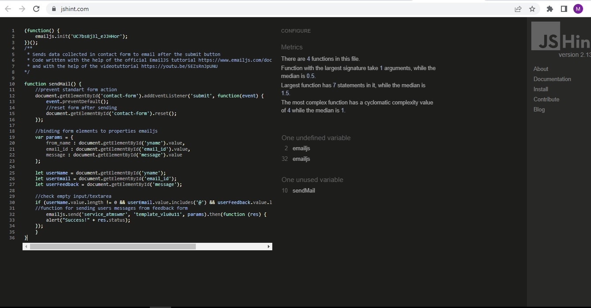
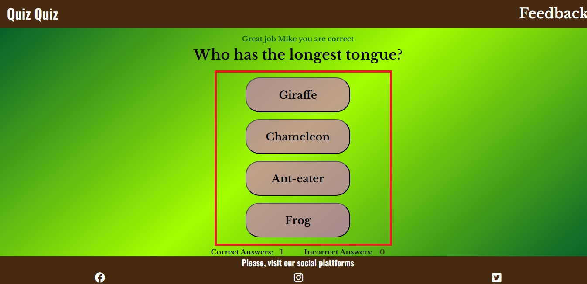

# Quiz Quiz
(Developer: Bilan Mykhailo)

The site presents a quiz in which the user can test their knowledge in several disciplines: nature, history, geography and logic. The user's action is to select the correct answer to the question asked. At the end of the quiz, the result that the user has achieved is displayed. Also, the user can leave feedback on a separate page of the site by filling out the feedback form.

[Live webpage](https://belan-mihail.github.io/quiz-quiz/)

## Table of Content

1. [Project Goals](#project-goals)
    1. [User Goals](#user-goals)
    2. [Site Owner Goals](#site-owner-goals)
2. [User Experience](#user-experience)
    1. [Target Audience](#target-audience)
    2. [User Requrements and Expectations](#user-requrements-and-expectations)
    3. [User Stories](#user-stories)
    4. [Site Owner Stories](#site-owner-stories)
3. [Design](#design)
    1. [Design Choices](#design-choices)
    2. [Colors](#colors)
    3. [Fonts](#fonts)
    4. [Structure](#structure)
    5. [Wireframes](#wireframes)
4. [Technologies Used](#technologies-used)
    1. [Languages](#languages)
    2. [Frameworks & Tools](#frameworks--tools)
5. [Features](#features)
    1. [Homepage](#homepage)
    2. [Feedback](#feedback)
    3. [404 page](#404-page)
6. [Testing](#testing)
    1. [HTML Validation](#HTML-validation)
    2. [CSS Validation](#CSS-validation)
    3. [JavaScript Validation](#javascript-validation)
    4. [Accessibility](#accessibility)
    5. [Performance](#performance)
    6. [Device testing](#device-testing)
    7. [Browser compatibility](#browser-compatibility)
    8. [Testing user stories](#testing-user-stories)
7. [Bugs](#bugs)
8. [Deployment](#deployment)
9. [Credits](#credits)
    1. [Content](#content)
    2. [Code](#code)
10. [Acknowledgements](#acknowledgements)

## Project Goals

### User Goals

 - Pass an interesting quiz.
- Test your knowledge in various disciplines.
- Re-pass the quiz to increase your score.
- Leave feedback.

### Site Owner Goals

  - Increase in the number of guests;
  - Getting positive feedback from site users;

## User Experience

### Target Audience

- A student who wants to test his knowledge in various disciplines or wants to take a quiz.
- An adult who wants to test their knowledge in various disciplines or wants to take a quiz.

### User Requrements and Expectations

- Simple and user-friendly website design;
- Interactive interaction with the user (reaction to user actions)
- Availability of the site on various devices

### User Stories 

1. As a user, I want to display my name for later use by the site.
2. As a user, I want to test my knowledge in various disciplines.
3. As a user, I want to have a choice of answers to a given question.
4. As a user, I want to be notified if my answer is correct
5. As a user, I want to get the output of my result after passing the quiz
6. As a user, I want to be able to repeat the quiz to improve my score
7. As a user, I want to repeat the quiz to provide a new conclusion about my result
8. As a user, I want to be able to leave feedback about the quiz.
9. As a user, I want to be able to visit the social platforms of the project

### Site Owner Stories

1. As a owner of the site, i want increase in the number of guests;
2.  As a owner of the site, i want getting positive feedback from site users; 

## Design

### Design Choices

The site is designed to maximize the interest of users by the simplicity and use of its use. The design of the site is designed in such a way that the user can quickly and easily figure out how to use the site and easily get the desired result (the ability to play a quiz).

### Colors

For the text content of the header and footer of the site, a white color was chosen, which contrasts well with the dark background. For the text content of the main block, black was chosen to contrast well with the green background. Orange was chosen for the hover effects. I used Adobe Color to select the color.

Screenshot (Adobe Color)

### Fonts

For header and footer text, the Oswald font is used, connected using google fonts. For main, Libre Baskerville font was used with more bold fonts. Used fonts are well combined with each other

### Structure

The page is structured in a well know and user friendly. Upon arriving to the website the user sees a familiar type of navigation bar with the logo on the left side and the navigation links to the right. The website consists of two separate pages:

- **Home Page:** This is the main page of the site, which displays all the stages of the quiz. The page is conditionally divided into header, main block and footer. The page is interactive and when interacting with the user, I change my main block. Initially, the main block contains a greeting, a field for entering a username and a Start game button. After clicking on the Start game button, the main block includes the question, answer options and answer statistics. At the end of the quiz, the main block includes information with the result of the participant and a button to repeat the quiz;

- **Feedback Page:** contains a navigation menu in the header, a section with a feedback form, as well as a footer with links-icons to social networks.

### Wireframes

## Technologies Used

### Languages

- HTML;
- CSS;
- JS;

### Frameworks & Tools

- **Balsamiq.** Used to create the skeleton of the project; 

- **Google Fonts.** Used to connect fonts to the project;

- **Adobe Color.** Used to select colors; 

- **Git.** Used for version control;

- **GitHub.** Used to store the project code after being pushed from Git;

- **Gitpod.** Used to write html and css project code;

- **Paint.NET.** Used to process screenshots and pictures.

- **Favicons.io** used to added favicons on the site.

- **Cssgradient.io** used to added gradient on site.

- **EmailJS** used to receive user-submitted reviews.

- **Font Awsome.** Used to place icons on project pages;

- **JSHint** Used to test JS code;

- **Lighthouse** - Used to test Perfomance;

- **W3C Markup validation service** - Used to test HTML code

- **W3C Jigsaw CSS validation service**  Used to test css;

- **WAVE WebAIM web accessibility evaluation tool** - Used to test accessibility

## Features

### Homepage

 The home page contains a logo and navigation section, a main section, and a footer.

 ***Logo and Navigation*** 
  - this section is at the top. On the left is the logo, on the right navigation is represented by one link to the feedback page. 
  
  - This section is duplicated on all pages of the site so that the user can easily navigate through the pages of the site without using the "back" button.

   - This section has a color that contrasts with the background. The capital letters of the logo have an individual eye-catching color and a larger size.

 ***Main(Onload)*** 
  - Displays a welcome message, a username input field, and a Start Game button.

  - User stories covered: 1;

  ***Main(After Start Game)*** 
  - Displays a question, four possible answers and statistics of correct/incorrect answers.

- After the user selects an answer to the first question, a new question and new answer options appear.

- If the user's answer is correct, a message is displayed stating that the answer was given correctly and a point is credited to the correct answers.

- If the answer was given incorrectly, a message is displayed stating that the answer is incorrect and a score is added to the incorrect answers.

- User stories covered: 2, 3, 4;

***Main(At end of quiz)*** 

- Displays the user's result and a text notification (depending on the result) as well as a button to repeat the quiz.

- When you click on the button to repeat the quiz - the user is given the opportunity to take the quiz again

- After re-passing the quiz, a new result of the user is displayed

- User stories covered: 5, 6, 7;

 ***Footer***  

 - This section is located at the bottom of the page. in the middle, in a large, well-readable font, there is a title calling for action - visiting the social pages of the site. Below, under the heading, there are icons depicting the corresponding social networks, which are links.

- This section is duplicated on all pages of the site.

- The color of the text and icons contrasts well with the background of the section.

- User stories covered: 9;

### Feedback

- This section is located only on the feedback page, immediately below navigation bar.

- The feedback form is consisted from name input block, email input block and textarea block for users feedback. Below is the submit button.

- To be more responsive to user actions,  the button changes color after mouse hover.

- For the convenience of the user, the input fields contain a placeholder text.

- User stories covered: 8

### 404 page

- This section is only on the 404 page, just below the navigation bar.

- This section consists of a single heading placed in the center of the page and highlighted with an accent color, notifying the user that the page was not found.

- this section is necessary to avoid displaying a standard 404 page with a missing page and giving the user the opportunity to select another page or go to the site's social network in this case.

## Testing

### HTML Validation

The W3C Markup Validation Service was used to validate the HTML of the website. All pages pass with no errors no warnings to show.

Home page

Feedback page

404 page

### CSS Validation

W3C Jigsaw CSS Validation Service was used to validate CSS

style.css

### JavaScript Validation

JSHint Static Code Analysis Tool for JavaScript was used to validate the Javascript files. No significant issues were found.

script.js

feedback.js

### Accessibility

Accessibility testing was carried out using the WAVE WebAIM service. No contrast errors were found. 

Home

Feedback

404

### Performance

Google Lighthouse in Google Chrome Developer Tools was used to test the performance of the website.

Home

Feedback

### Device testing

The website was tested on the following devices:

   - Iphone 7;
   - Iphone 12 Pro;

In addition, the website was tested using Google Chrome Developer Tools Device Toggeling option for all available device options.

### Browser compatibility

The website was tested on the following browsers:

   - Google Chrome;
   - Yandex Browser;
   - Mozilla Firefox;

### Testing User Stories

   1. As a user, I want to display my name for later use by the site.

   **Action** | **Result** 
 -----------| ----------  
 1.Being on the home page, scroll to the middle. Write your name in input form | You can display your name for later use by the site 

Screenshot evidences

 

  2. As a user, I want to test my knowledge in various disciplines.

  **Action** | **Result** 
 -----------| ----------  
 1 Being on the home page, scroll to the middle. Click button "Start Game" | You can start the quiz with questions from various disciplines (nature, history, geography, logic)
 

Screenshot evidences

 

  3. As a user, I want to have a choice of answers to a given question.

  **Action** | **Result** 
 -----------| ----------  
 1 Being on the home page, scroll to the middle. Click button "Start Game" | You can start a quiz with questions for each of which there are four possible answers
 

Screenshot evidences

 

  4. As a user, I want to be notified if my answer is correct  

  **Action** | **Result** 
 -----------| ----------  
 1 Being on the home page, scroll to the middle. Click button "Start Game" | You can start a quiz
 2 Click on one of the answers to the question | Depending on whether the answer is correct or not, you will receive a notification and an increase in points for a correct or incorrect answer.

Screenshot evidences

 

5. As a user, I want to get the output of my result after passing the quiz

  **Action** | **Result** 
 -----------| ----------  
 1 Being on the home page, scroll to the middle. Click button "Start Game" | You can start a quiz
 2 Answer all quiz questions | You will receive the output of the quiz results

Screenshot evidences

 

6. As a user, I want to be able to repeat the quiz to improve my score

  **Action** | **Result** 
 -----------| ----------  
 1 Being on the home page, scroll to the middle. Click button "Start Game" | You can start a quiz
 2 Answer all quiz questions | You will receive the output of the quiz results
 3 Click button "Restart Quiz" | the quiz will restart

Screenshot evidences

 

7. As a user, I want to repeat the quiz to provide a new conclusion about my result

  **Action** | **Result** 
 -----------| ----------  
 1 Being on the home page, scroll to the middle. Click button "Start Game" | You can start a quiz
 2 Answer all quiz questions | You will receive the output of the quiz results
 3 Click button "Restart Quiz" | the quiz will restart
 4 Answer again all quiz questions | You will receive the output of the new quiz results

 

Screenshot evidences

 

8. As a user, I want to be able to leave feedback about the quiz.

  **Action** | **Result** 
 -----------| ----------  
 1 Being on the home page, click on the feedback link on the right side of the screen | You will be redirected to the feedback page
 2 fill out the feedback form and click the "Send" button | You can send feedback

Screenshot evidences

 

9. As a user, I want to be able to visit the social platforms of the project

  **Action** | **Result** 
 -----------| ----------  
 1 Being on the home page, scroll down and click to the one of social icons | You can visit social platforms

 

Screenshot evidences

 

## Bugs

- The site logo was designed as a simple link and was not a first level heading, which is why the site did not have a first level heading

    **Actions**: add a first level heading to the logo link;

    **Result**: the site logo also became the first level heading and the first level heading appeared on the site;

    **Status**: bug fixed;

- in the div element with the class footer-heading, the start tag is H2 and the closing tag is P

  **Actions**: add closing tag H2;

  **Result**: The div element with the class footer-heading has a valid start and end tag;

  **Status**: bug fixed;

- checking scripts using the JSHint Static Code Analysis Tool service found an extra semicolon in the code and the absence of a semicolon in other parts of the code

    **Actions**: remove extra semicolons and add missing ;

    **Result**: the script passes validation in the JSHint Static Code service;

    **Status**: bug fixed;
  
  - missed 404 page validation check

    **Actions**: check the validation of the 404 page and add screenshots-evidence of passing the check to the HTML VALIDATION block;

      **Result**: the validity of the 404 page was checked, evidence of passing the check by this page was added to README;

      **Status**: bug fixed;

  - incorrect spelling of the object property (second answer) in all objects of the quizContent array, as a result of which question 2 was not displayed

      **Actions**: fix object property value (second answer) in all objects of the quizContent array

      **Result**: after the fix, the second question of the quiz now displays correctly;

      **Status**: bug fixed;

## Deployment

**The website was deployed using GitHub Pages:**

1. In the GitHub repository navigate to the Settings tab
2. On the menu select "Pages"
3. For the source select Branch: master
4. After the website completed automaticaly you will be a ribbon on the top saying: "Your site is published at https://belan-mihail.github.io/quiz-quiz/"

**How to clone the website:**
1. On GitHub.com, navigate to the main page of the repository.
2. click "Code" button.
3. Select HTTPS, SSH, or Github CLI.
4. Open Git Bash
5. Change the current working directory to the one where you want the cloned directory
6. Type git clone and paste the URL from the clipboard ($ git clone https://github.com/YOUR-USERNAME/YOUR-REPOSITORY) 
7. Press Enter to create your local clone. 

steps created using description on [GitHub Docs](https://docs.github.com/en/repositories/creating-and-managing-repositories/cloning-a-repository)

**How to fork the website:**
1. Go to the GitHub repository
2. Click on Fork button

The live link can be found here - [Quiz Quiz](https://belan-mihail.github.io/quiz-quiz/)

## Credits

### Content 

**Text content** including descriptions of various objects are owned by the developer.

**The fonts** used on the pages were connected from the site - [Google Fonts](https://fonts.google.com/)

The icons used on the site were taken from the site - [Font Awesome](https://fontawesome.com/)

The favicons used on the site were created by the site - [Favicons.io](https://favicon.io/)

### Code

- Email sending JavaScript API code was written with the help of the official EmailJS tutorial https://www.emailjs.com/docs/tutorial/creating-contact-form/

- Email sending JavaScript API code was written with the help of the video tutorials from youtube (https://youtu.be/5EZsRnJpUNU) Contact Form with Email Js | Send Emails using JavaScript through Email Js | Email Js Tutorial. Author video: ALTERCODES 

## Acknowledgements

I would like to express my sincere gratitude:

  - My mentor Mo Shami for his advice and support.
  - My daughter Alisa and my wife Snizhana for always giving me inspiration and strength to go forward.
  - The government of the city of Hamburg and the employees of the job center Mitti for my opportunity to study at these courses.
  - To all people who are in solidarity and support Ukraine